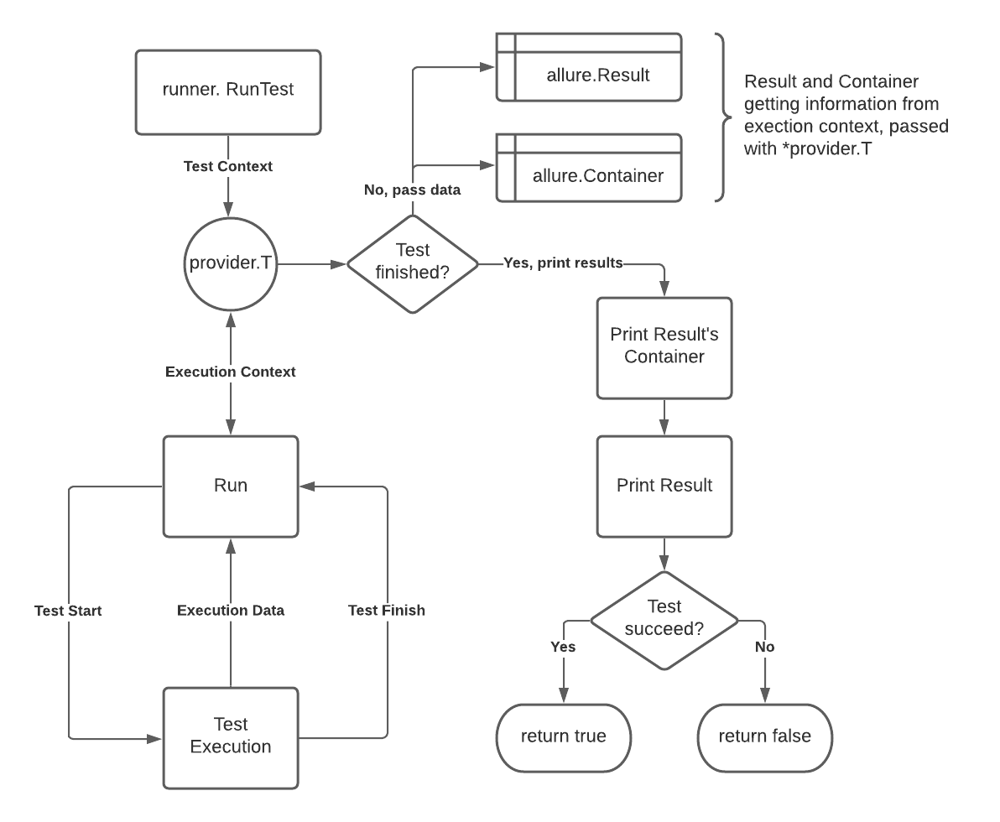
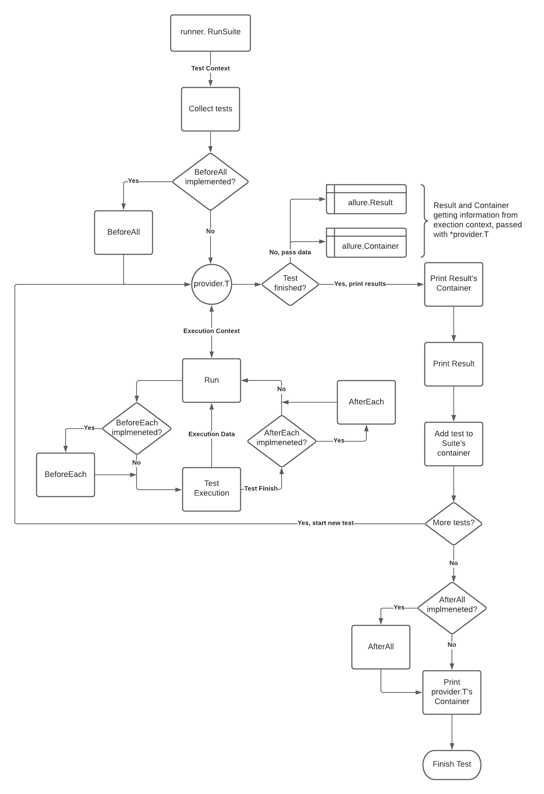

# runner

Пакет `runner` предоставляет ряд способов для запуска тестов и групп тестов, как используя сьюты, аналогичные
сьютам `testify`, так и с помощью классической формы работы с тестами стандартной библиотеки `testing`.

Для быстрых и простых тестов рекомендуется использование запуска с помощью функции RunTest, для запуска групп тестов -
структура `runner.TestRunner`. Для запуска `suite.Suite` - статическая функция `runner.RunSuite`.<br>
**Note**: на данный момент поддерживаются только сьюты библиотеки allure-testify

## Head of contents

- [head of contents](#head-of-contents)
- [static](#static)
    - [func RunTest(realT *testing.T, testName string, f func(t *provider.T), tags ...string) bool](#func-runtestrealt-testingt-testname-string-f-funct-providert-tags-string-bool)
    - [func RunSuite(realT *testing.T, suite framework.TestSuite)](#func-runsuiterealt-testingt-suite-frameworktestsuite)
- [struct](#struct)
    - [func NewTestRunner(realT *testing.T) *TestRunner](#func-newtestrunnerrealt-testingt-testrunner)
    - [func (runner *TestRunner) WithBeforeEach(beforeEach func(t *provider.T))](#func-runner-testrunner-withbeforeeachbeforeeach-funct-providert)
    - [func (runner *TestRunner) WithAfterEach(afterEach func(t *provider.T))](#func-runner-testrunner-withaftereachaftereach-funct-providert)
    - [func (runner *TestRunner) Run(testName string, test func(t *provider.T), tags ...string) bool](#func-runner-testrunner-runtestname-string-test-funct-providert-tags-string-bool)

## [static](static.go)

### `func RunTest(realT *testing.T, testName string, f func(t *provider.T), tags ...string) bool`

#### arguments

| Argument | Meaning |
|---|---|
|`realT *testing.T`|Контекст исполнения теста, прокидываемый через библиотеку testing|
|`testName string`|Имя нового теста|
|`f func(t *provider.T)`|Тело нового теста. `*provider.T` - обертка для тестового контекста `*testing.T`.|
|`tags ...string`|Перечисление тегов, которые будут проставлены в тестовый отчет.|

#### return value

| Return Value | Meaning |
|---|---|
|`bool`|Возвращает true, если исполнение теста прошло успешно и false, если произошли какие либо ошибки или паника|

Запускает тест, переданный в аргумент `f`. По окончанию исполнения будет создан `result.json` и `container.json` (если
не пустой). <br>
Схема работы:



### `func RunSuite(realT *testing.T, suite framework.TestSuite)`

#### arguments

| Argument | Meaning |
|---|---|
|`realT *testing.T`|Контекст исполнения теста, прокидываемый через библиотеку testing|
|`suite framework.TestSuite`|указатель на Suite, который вы хотите запустить. Структура Suite обязательно должна реализовывать интерфейс `framework.TestSuite`|

Находит все методы переданной структуры, начинающиеся с префикса `Test` и исполняет их. <br>
Если структура реализует методы `BeforeEach`, `BeforeAll`, `AfterEach` и/или `AfterAll`, они так же будут
исполнены. <br>
**Note:** подробнее про эти методы можно прочитать [тут](#beforeafters)



## [struct](struct.go)

Описание структуры:

```go
package runner

import "github.com/ozontech/allure-go/pkg/provider"

// ITestRunner TestRunner interface
type ITestRunner interface {
	WithBeforeEach(beforeEach func(t *provider.T))
	WithAfterEach(afterEach func(t *provider.T))
	Run(testName string, test func(t *provider.T), tags ...string) bool
}

// TestRunner ...
type TestRunner struct {
	t *provider.T // Указатель на контекст T, нужный для запуска и мониторинга тестов
}
```

`TestRunner` - структура, позволяющая запускать некоторое количество тестов с использованием Before/After Test хуков.
Содержит в себе указатель на тестовый контекст `provider.T`. Поддерживает параллельный запуск тестов.

Реализует интерфейсы

- ITestRunner

### func NewTestRunner(realT *testing.T) *TestRunner

#### arguments

| Argument | Meaning |
|---|---|
|`realT *testing.T`|Контекст исполнения теста, прокидываемый через библиотеку testing|

Конструктор. Создает новый экземпляр `TestRunner`, инициализируя `provider.T` на основе переданного `realT`.<br>
Возвращает указатель на созданный экземпляр `TestRunner`.

### func (runner *TestRunner) WithBeforeEach(beforeEach func(t *provider.T))

#### arguments

| Argument | Meaning |
|---|---|
|`beforeEach func(t *provider.T)`|функция, которая будет выполняться перед каждым тестом, запущенным в `TestRunner`|

Устанавливает функцию, которая будет исполняться перед каждым тестом для конкретного экземпляра `TestRunner`. Если
функция не указана, beforeEach будет пропущен во время исполнения теста.

### func (runner *TestRunner) WithAfterEach(afterEach func(t *provider.T))

| Argument | Meaning |
|---|---|
|`afterEach func(t *provider.T)`|функция, которая будет выполняться после каждого теста, запущенного в `TestRunner`|

Устанавливает функцию, которая будет исполняться после каждого теста для конкретного экземпляра `TestRunner`. Если
функция не указана, afterEach будет пропущен во время исполнения теста.

### func (runner *TestRunner) Run(testName string, test func(t *provider.T), tags ...string) bool

#### arguments

| Argument | Meaning |
|---|---|
|`testName string`|Имя нового теста|
|`f func(t *provider.T)`|Тело нового теста. `*provider.T` - обертка для тестового контекста `*testing.T`.|
|`tags ...string`|Перечисление тегов, которые будут проставлены в тестовый отчет.|

#### return value

| Return Value | Meaning |
|---|---|
|`bool`|Возвращает true, если исполнение теста прошло успешно и false, если произошли какие либо ошибки или паника|

Работает аналогично статической
функции [`runner.RunTest`](#func-runtestrealt-testingt-testname-string-f-funct-providert-tags-string-bool)
за исключением того, что контекст `T` будет принадлежать экземпляру структуры `TestRunner`.<br>
Если для TestRunner заданы `BeforeEach` или `AfterEach` они будут исполнены до/после теста соответственно. Возвращает
true, если тест выполнен успешно. False - в случае ошибки или паники.